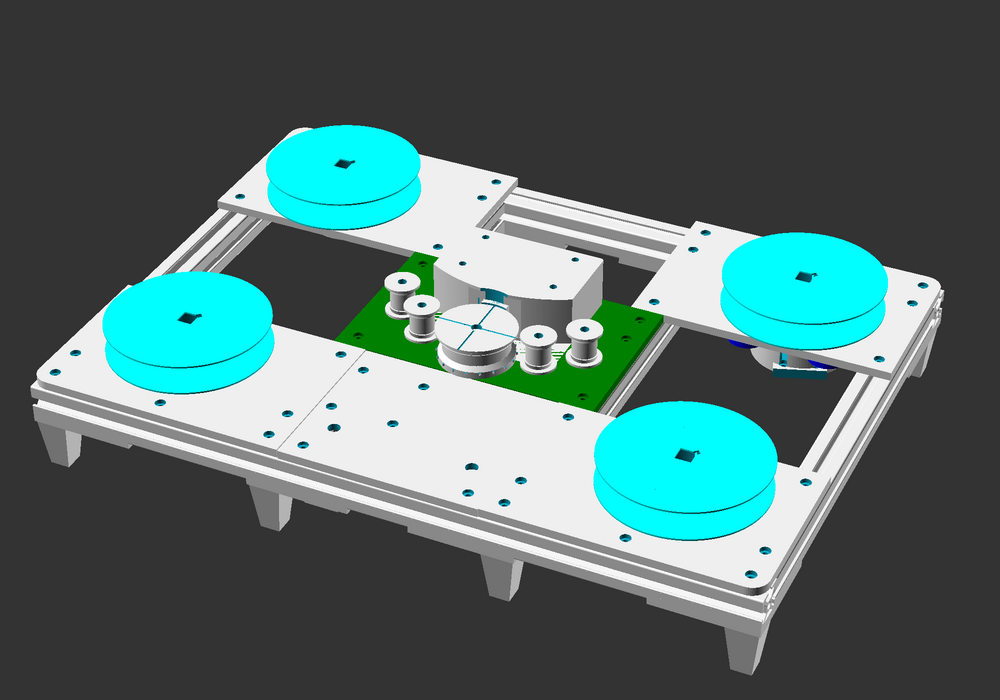

# contact printer

A desktop 16mm contact printer and film transport platform made using 3D printing and aluminum extrusion.

---

---

#### NOTE: This is a work in progress. Build instructions and whitepaper to follow.

This contact printer is designed to make 16mm prints using affordable electronics and 3D printing.
It is *not* intended as a replacement for professional printers like the Bell & Howell Model C.
This project is for DIY filmmakers, independent artists and small film labs to have a machine that can produce reasonable-quality work prints with a small footprint on short lengths of film easily.

This is intended to be a modular printer.
As of now there is only a single lamp design that uses standard white 5mm LEDs.

# Examples

[Contact](https://vimeo.com/flashfra/contact?share=git) the first print made on the prototype during a residency at [Filmwerkplaats](https://filmwerkplaats.org/).
Soundtrack applied by the opt_snd soundtrack recorder system by [Hrvoje Spudić](https://hrvojespudic.net/optical-sound-2).

# Print Counts

Here is a table of all the parts and how many of them to print to make a single contact printer.

<!-- prints -->

|                 Part                 | Print Count |                              Download                               |
|--------------------------------------|-------------|---------------------------------------------------------------------|
| daylight spool insert reinforced nut | 4           | [STL](stl/contact_printer_daylight_spool_insert_reinforced_nut.stl) |
| slip coupling                        | 4           | [STL](stl/contact_printer_slip_coupling.stl)                        |
| magnetic coupling                    | 2           | [STL](stl/contact_printer_magnetic_coupling.stl)                    |
| knob                                 | 14          | [STL](stl/contact_printer_knob.stl)                                 |
| lamp LEDs                            | 1           | [STL](stl/contact_printer_lamp_LEDs.stl)                            |
| sprocketed roller invert solid       | 1           | [STL](stl/contact_printer_sprocketed_roller_invert_solid.stl)       |
| corner foot                          | 8           | [STL](stl/contact_printer_corner_foot.stl)                          |
| feed panel motor mount               | 2           | [STL](stl/contact_printer_feed_panel_motor_mount.stl)               |
| feed panel stock                     | 1           | [STL](stl/contact_printer_feed_panel_stock.stl)                     |
| feed panel picture                   | 1           | [STL](stl/contact_printer_feed_panel_picture.stl)                   |
| takeup panel stock motor mount       | 1           | [STL](stl/contact_printer_takeup_panel_stock_motor_mount.stl)       |
| takeup panel stock                   | 1           | [STL](stl/contact_printer_takeup_panel_stock.stl)                   |
| takeup panel picture motor mount     | 1           | [STL](stl/contact_printer_takeup_panel_picture_motor_mount.stl)     |
| takeup panel picture                 | 1           | [STL](stl/contact_printer_takeup_panel_picture.stl)                 |
| panel                                | 1           | [STL](stl/contact_printer_panel.stl)                                |
| lamp cover                           | 1           | [STL](stl/contact_printer_lamp_cover.stl)                           |
| lamp single                          | 1           | [STL](stl/contact_printer_lamp_single.stl)                          |
| picture gate sound                   | 1           | [STL](stl/contact_printer_picture_gate_sound.stl)                   |
| picture gate super16                 | 1           | [STL](stl/contact_printer_picture_gate_super16.stl)                 |
| picture gate full                    | 1           | [STL](stl/contact_printer_picture_gate_full.stl)                    |
| picture gate standard                | 1           | [STL](stl/contact_printer_picture_gate_standard.stl)                |
| gate carrier                         | 1           | [STL](stl/contact_printer_gate_carrier.stl)                         |
| idle roller b                        | 4           | [STL](stl/contact_printer_idle_roller_b.stl)                        |
| idle roller half a                   | 4           | [STL](stl/contact_printer_idle_roller_half_a.stl)                   |

<!-- /prints -->

# Bill of Materials

Below are estimates based on per-unit costs found online.
Actual price of a full build may be higher.

<!-- bom -->

|                Part                 | Qty  | Cost (USD) |                   Minumum                   |
|-------------------------------------|------|------------|---------------------------------------------|
| M4 hex nut                          | 20   | $0.67      | [300 for $9.99](https://amzn.to/4i5ESna)    |
| M4 hex bolt 50mm                    | 4    | $2.68      | [10 for $6.69](https://amzn.to/3FYyh0s)     |
| M4 hex bolt 35mm                    | 6    | $3.72      | [10 for $6.19](https://amzn.to/4j14SRQ)     |
| M4 hex bolt 25mm                    | 10   | $1.84      | [50 for $9.19](https://amzn.to/3FW2EEG)     |
| M3 sliding t slot nut               | 72   | $4.11      | [105 for $5.99](https://amzn.to/48GRrSU)    |
| M3 hex cap bolt 8mm                 | 80   | $7.20      | [100 for $8.99](https://amzn.to/3YEvWNB)    |
| M3 hex cap bolt 6mm                 | 8    | $0.59      | [100 for $7.26](https://amzn.to/3AwiZxo)    |
| M3 hex cap bolt 12mm                | 1    | $0.09      | [100 for $8.36](https://amzn.to/48CGa5Y)    |
| L298N Motor driver module           | 1    | $2.88      | [4 for $11.49](https://amzn.to/4ellssy)     |
| ESP32 GPIO breakout board           | 1    | $6.00      | [2 for $11.99](https://amzn.to/3UFjpbO)     |
| ESP32 Dev board                     | 1    | $6.67      | [3 for $19.99](https://amzn.to/3NXCvGj)     |
| 608-RS Ball Bearing                 | 1    | $0.18      | [100 for $17.79](https://amzn.to/4fKxDA7)   |
| 5mm White LED                       | 6    | $0.36      | [100 for $5.99](https://amzn.to/42AopCE)    |
| 250RPM DC geared motor              | 2    | $29.98     | [1 for $14.99](https://amzn.to/3NWkcRL)     |
| 220 Ohm Resistor                    | 6    | $0.36      | [100 for $5.99](https://amzn.to/3YlywJ7)    |
| 2020 Aluminum extrusion mm          | 1880 | $11.41     | [12200 for $73.99](https://amzn.to/418OicC) |
| 100RPM DC geared motor with encoder | 1    | $16.19     | [1 for $16.19](https://amzn.to/3UF707G)     |
|---------|------|--------|---------|
| TOTAL   | 2100 | $94.93 | $241.07 |

<!-- /bom -->

## Acknowledgements

Developed with support from [Filmwerkplaats at WORM](https://worm.org/spaces/filmwerkplaats/) and [SPECTRAL](http://www.spectral-cinematics.eu/).
Read the [report from the residency](./docs/report) provided by Filmwerkplaats.
[Report as PDF.](./docs/report/residency_report.pdf)

Special thanks to [Esther Urlus](https://estherurlus.hotglue.me/), [Hrvoje Spudić](https://hrvojespudic.net/) and [Nan Wang](https://nanwang.org/).

Magnetic clutch design inspired by Clyde Shaffer's [Shaffer Linear Processor](https://clydeshaffer.com/slp/).

---

## [Project Home: git.sixteenmillimeter.com/16mm/contact_printer](https://git.sixteenmillimeter.com/16mm/contact_printer)

###  [Github Mirror: github.com/sixteenmillimeter/contact_printer](https://github.com/sixteenmillimeter/contact_printer)
